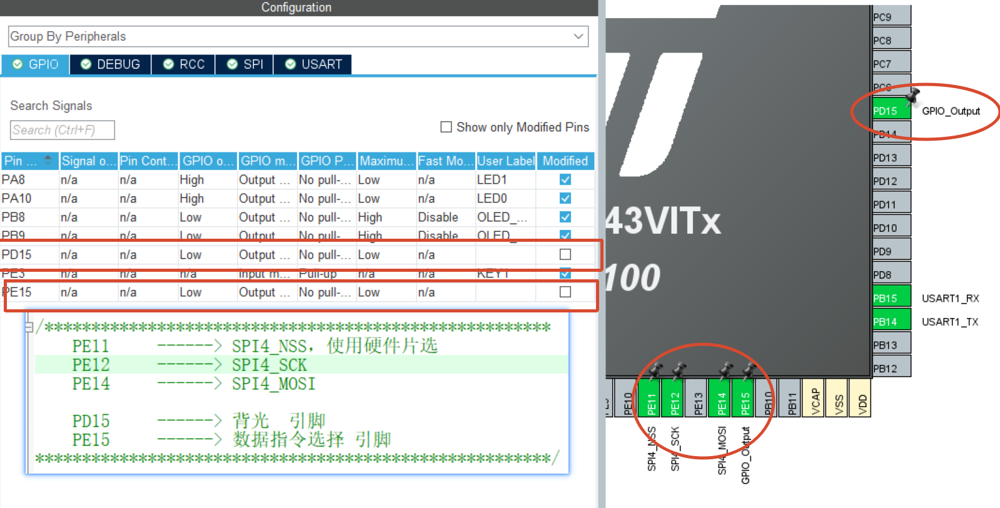
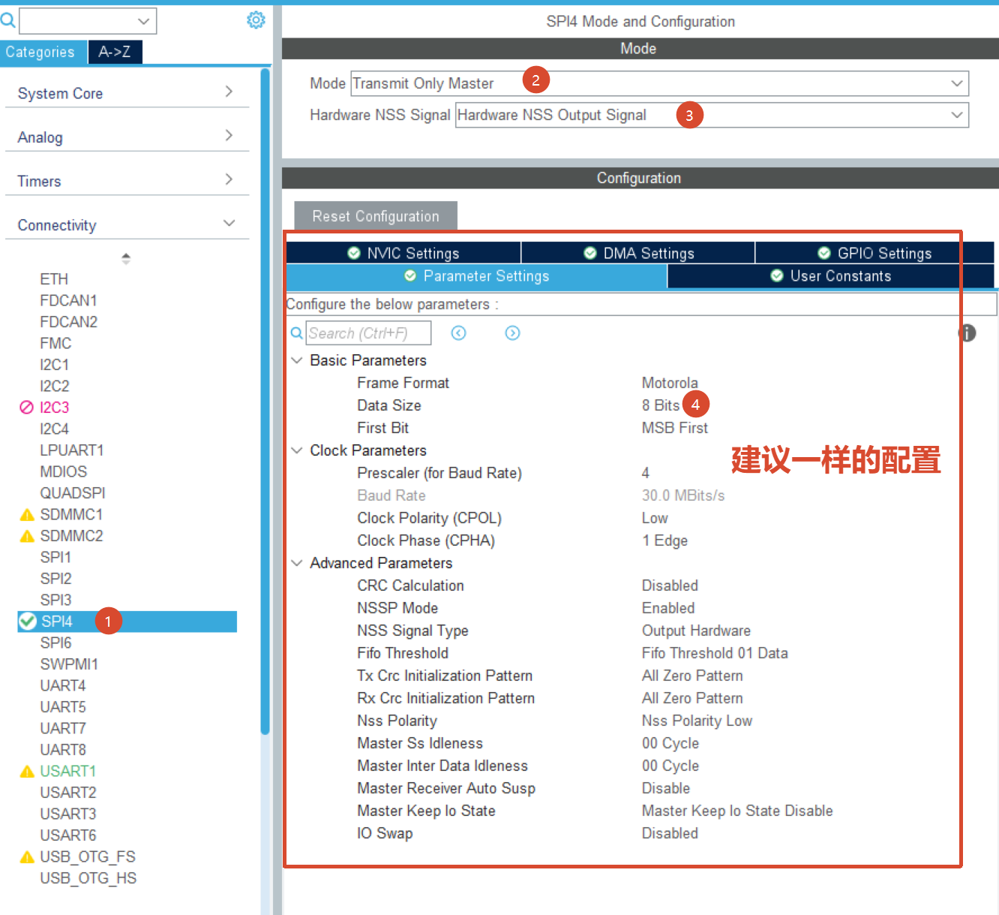
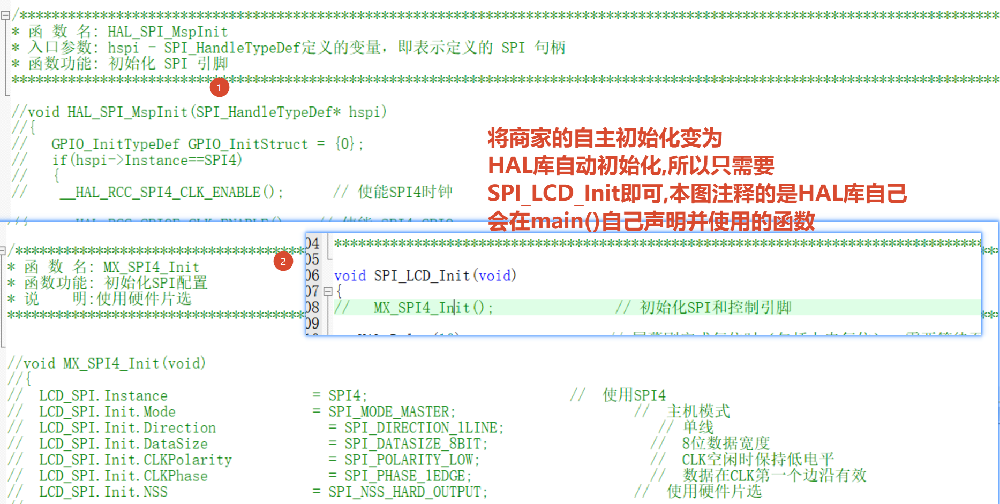

# SmartCar

# 1. 工程架构

+ System: 系统级驱动文件
  + IIC 
  + SPI
  + ADC
  + 等
+ Hardware 硬件底层驱动
+ Function 硬件上层逻辑实现
+ Tools 工具
+ APP 最高应用层

# 2. 时钟树配置

* 直接借鉴东边电工基地的配置,使用480MHz

# 3. LCD-SPI配置

+ 引脚配置:
  + 只需要输出不需要输入
  + 所以不需要配置MISO

+ SPI配置

+ 不需要DMA和NVIC

+ 移植指南

