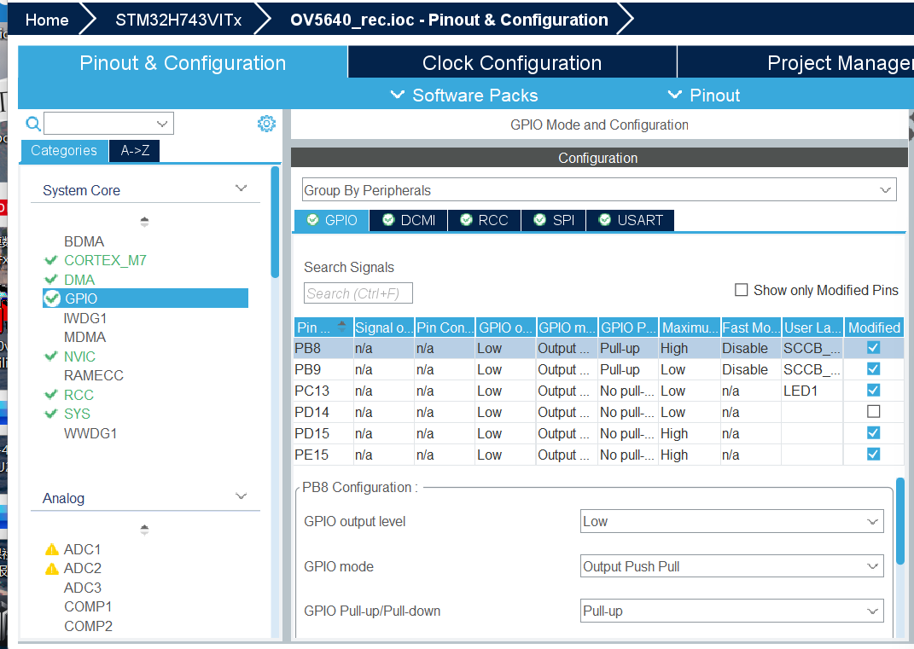
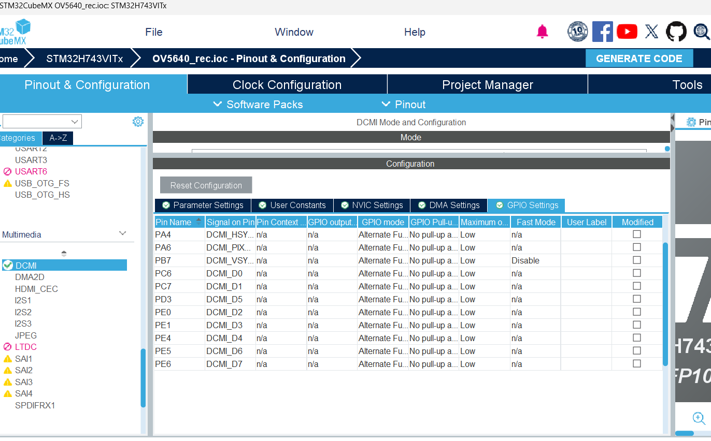
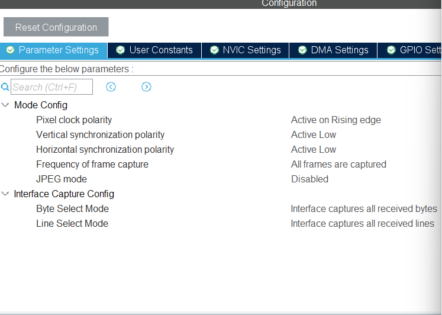
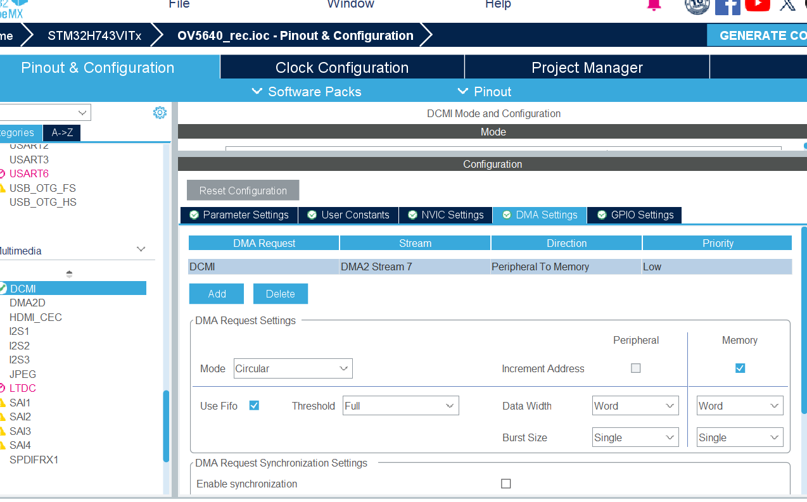
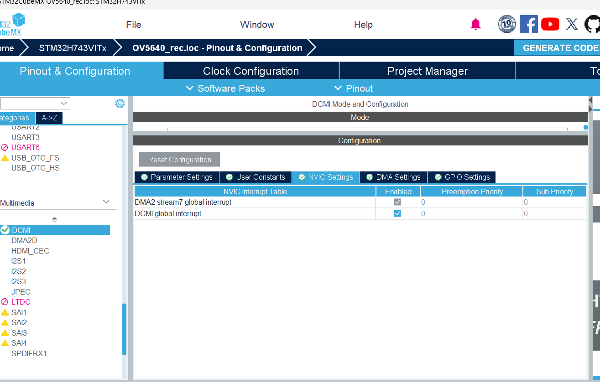
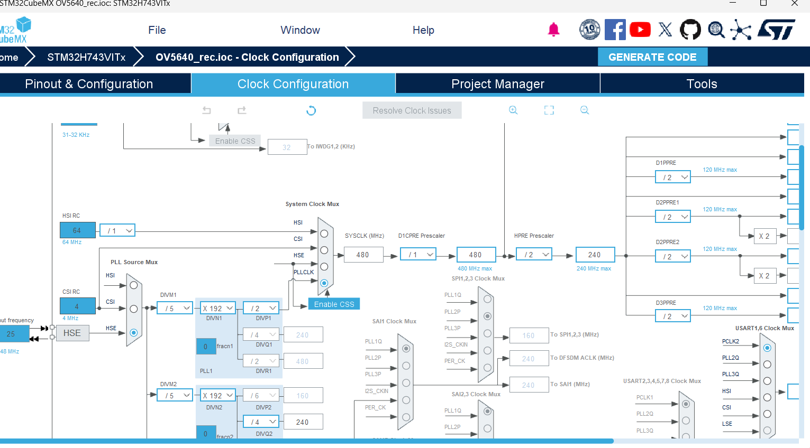
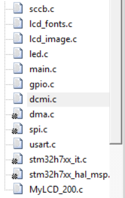

# 摄像头基本配置

## 1.CUBEMX主要配置

- 时钟基本配置
- GPIO
  	- 软件I2C
  	- led

- SPI
- USART
- DCMI

###  1.软件I2C

找两个合适的gpio引脚配置软件I2C，这里用的PB8为SCL，PB9为SDA

​	I2C具体的配置代码沿用商家的sccb.h和sccb.c

剩下几个gpio分别是led的配置以及我记得是与spi背光有关的配置

### 2.SPI

沿用template里的SPI4配置即可

### 3.USART

配置的USART1，PA9为TX，PA10为RX，其余配置同模版工程

### 4.DCMI

- 先放上引脚的配置

- 然后是参数的配置

主要注意那几个polarity不要配错了

- DMCI里DMA这样配

主要注意一下要选DMA2 Stream 7，里面的配置按着图来就可以了

- 以及最后启用一下中断

  

  

### 5.时钟树

时钟树我是这样配的

## 2.工程内配置

- 内存分配按这样配，我还不知道有的具体是为什么，反正按商家这样是可以的

.png)

- 基本工程文件架构

这是一些需要的文件

	- sccb.c,lcd开头的两个以及MyLCD_200.c直接复制到工程里即可
	- dcmi.c需要把我的USER CODE BEGIN 0和USER CODE BEGIN 1里面的内容复制进去
	- 剩下的全按CUBEMX默认生成即可

